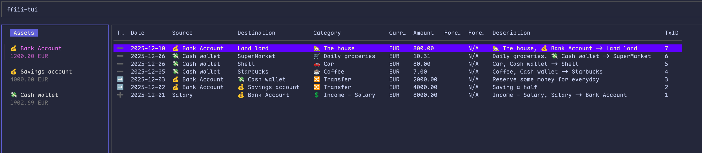
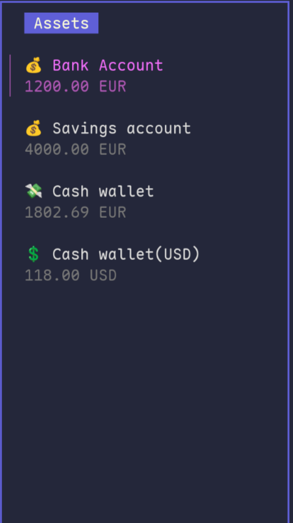
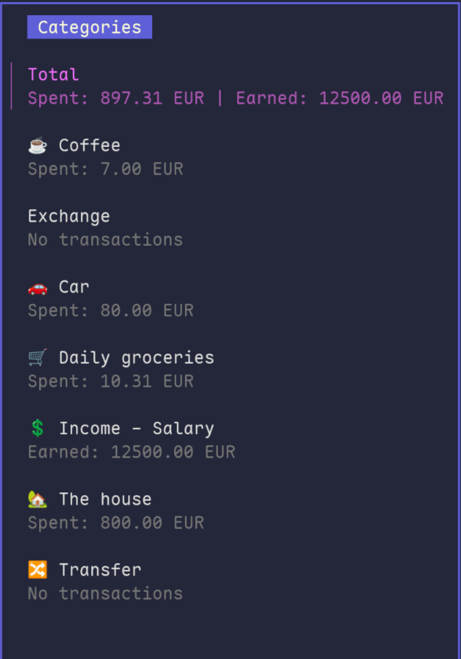
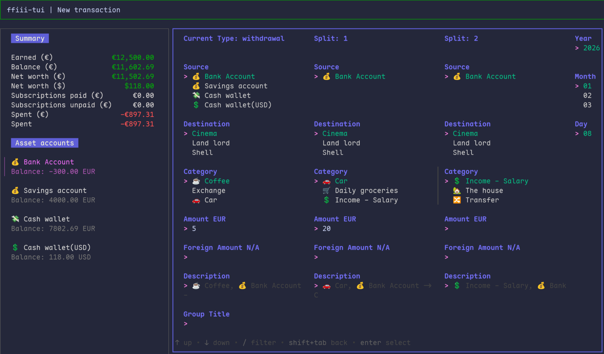

# ffiii-tui

_Warning: This project is in early development and may not be fully functional._



`ffiii-tui` is a TUI for Firefly III personal finance manager.

## Features

- View and manage transactions, assets, categories, expenses, and revenue accounts.

   

- Create, edit(tbd), and delete(tbd) financial records directly from the terminal.


## Installation

To install the dependencies, ensure you have Go installed, then run:

```bash
go mod tidy
```

To build  `ffiii-tui`:

```sh
go build
```

## Usage

```bash
./ffiii-tui
# or
./ffiii-tui --config path/to/your/config.yaml
# or
./ffiii-tui -k YOUR_API_KEY -u https://your-firefly-instance.com/api/v1
```

## Configuration

The tool requires a configuration YAML file that specifies:

- Firefly III API credentials, including:
  - `firefly.api_key`: Your Firefly III API key. [How to get an API key](https://docs.firefly-iii.org/how-to/firefly-iii/features/api/#personal-access-tokens)
  - `firefly.api_url`: The base URL for the Firefly III API.

Example configuration (config_example.yaml):

```yaml
firefly:
  api_key: YOUR_API_KEY
  api_url: https://your-firefly-instance.com/api/v1
```

To initialize a sample configuration file, run:

```sh
./ffiii-tui init-config
```

The new configuration file will be created at `./config.yaml`.

You can also specify API key, and API URL directly when initializing the config:

```sh
./ffiii-tui init-config -k YOUR_API_KEY -u https://your-firefly-instance.com/api/v1
```

## Dependencies

Main dependencies include:
- [Charmbracelet Bubbles](https://github.com/charmbracelet/bubbles)
- [Charmbracelet Bubble Tea](https://github.com/charmbracelet/bubbletea)
- [Charmbracelet Lip Gloss](https://github.com/charmbracelet/lipgloss)
- [Cobra](https://github.com/spf13/cobra)
- [Viper](https://github.com/spf13/viper)

## Contributing

Please feel free to submit issues or pull requests.

## License

This project is licensed under the MIT License. Check the `LICENSE` file for details.
